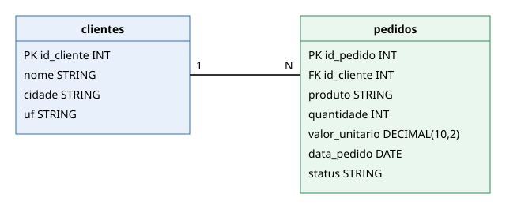

# Contextualização do Trabalho

Trabalho de pesquisa da disciplina **Engenharia de Dados** (Engenharia de Software – 5ª fase – SATC), professor Jorge Luiz da Silva.

## Objetivo
Criar um ambiente **PySpark + JupyterLab**, gerenciado com **UV**, e demonstrar os comandos **INSERT, UPDATE e DELETE** em tabelas dos formatos **Delta Lake** e **Apache Iceberg**.

## Cenário e conjunto de dados
Loja virtual fictícia. O conjunto de dados foi **criado pelo grupo** e está em `data/`:

| Arquivo | Conteúdo |
|---|---|
| `data/clientes.csv` | 4 clientes |
| `data/pedidos.csv` | 5 pedidos |

### Modelo ER


Um cliente possui vários pedidos (relação 1:N por `id_cliente`).

### DDL (padrão para os dois formatos)
```sql
CREATE TABLE clientes (
  id_cliente INT, nome STRING, cidade STRING, uf STRING
) USING <delta | iceberg>;

CREATE TABLE pedidos (
  id_pedido INT, id_cliente INT, produto STRING, quantidade INT,
  valor_unitario DECIMAL(10,2), data_pedido DATE, status STRING
) USING <delta | iceberg>;
```

## Ferramentas utilizadas
| Ferramenta | Uso |
|---|---|
| Pyenv | Versão do Python (3.11) |
| UV | Gerenciador de pacotes e ambiente virtual |
| Git / GitHub | Versionamento e repositório |
| PySpark 3.5.3 | Processamento |
| delta-spark 3.2.1 | Delta Lake |
| iceberg-spark-runtime-3.5_2.12 1.6.1 | Apache Iceberg |
| JupyterLab | Notebooks |
| Pytest, Ruff, Isort, pip-audit | Testes e padrão de código |
| Taskipy | Atalhos de comandos |
| MkDocs | Esta documentação |

## Notebooks
- `src/delta/delta_lake.ipynb`
- `src/iceberg/apache_iceberg.ipynb`
